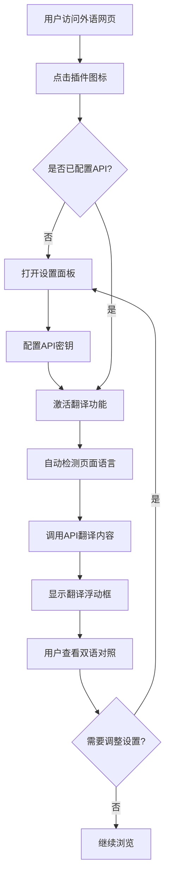

# 语影翻译插件产品需求文档

## 1. Product Overview

语影是一款专为外语学习者、研究人员、内容创作者设计的非覆盖式双语对照翻译插件。通过"影子"般的实时翻译展示，保留原文的同时提供高质量翻译内容，提升用户的阅读与理解效率。

* 核心价值：智能陪伴式翻译体验，无需切换页面或复制粘贴，依托大模型API提供精准的双语对照功能。

* 目标市场：面向需要高效外语阅读的专业用户群体，解决传统翻译工具覆盖原文、影响阅读体验的痛点。

## 2. Core Features

### 2.1 User Roles

本产品采用单一用户角色设计，无需复杂的权限区分：

| Role | Registration Method | Core Permissions     |
| ---- | ------------------- | -------------------- |
| 普通用户 | 直接安装插件使用            | 可使用所有翻译功能，需自行配置API密钥 |

### 2.2 Feature Module

语影翻译插件包含以下核心页面：

1. **浏览器工具栏图标**：插件入口，显示状态和快速操作
2. **设置面板**：API配置、翻译偏好设置、使用统计
3. **翻译浮动框**：实时显示翻译内容的半透明悬浮窗口

### 2.3 Page Details

| Page Name | Module Name | Feature description                                                            |
| --------- | ----------- | ------------------------------------------------------------------------------ |
| 浏览器工具栏图标  | 状态显示        | 显示蓝色对话气泡+EN→CHN字样，实时反映翻译状态（激活/未激活）                                             |
| 浏览器工具栏图标  | 快速操作        | 点击触发翻译开关，长按或右键显示快捷菜单                                                           |
| 设置面板      | API配置模块     | 支持多种大模型API配置（DeepSeek默认，支持通义千问、OpenAI、Gemini等），验证连接状态，显示使用配额，优先级：国内>国外，配置难度小>大 |
| 设置面板      | 翻译设置        | 开启/关闭自动翻译，选择目标语言，设置翻译位置偏好（右侧/下方优先）                                             |
| 设置面板      | 界面设置        | 调整字体大小（默认14px），选择翻译框透明度，设置快捷键                                                  |
| 设置面板      | 使用统计        | 查看API调用次数、剩余配额、翻译历史记录                                                          |
| 翻译浮动框     | 内容展示        | 显示翻译结果，采用半透明灰底（#D3D3D3，80%透明度），白色文字                                            |
| 翻译浮动框     | 交互控制        | 右上角折叠/展开按钮（▲/▼），支持拖拽调整位置                                                       |
| 翻译浮动框     | 智能定位        | 优先显示在原文右侧空白区域，无空间时自动调整到下方                                                      |

## 3. Core Process

### 用户操作流程

1. **初次使用**：用户安装插件后，点击工具栏图标进入设置面板，配置API密钥
2. **日常翻译**：访问外语网页时，点击插件图标激活翻译功能，系统自动检测语言并开始翻译
3. **查看翻译**：翻译内容以浮动框形式显示在原文旁边，用户可折叠/展开或拖拽调整位置
4. **设置调整**：用户可随时通过设置面板调整翻译偏好、查看使用统计



## 4. User Interface Design

### 4.1 Design Style

* **主色调**：深蓝色（#0A2E5C）体现专业感，浅灰色（#E0E0E0）营造科技感，橙色（#FF6F00）用于强调和操作按钮

* **辅助色**：半透明灰色（#D3D3D3，80%透明度）用于浮动框背景，提供微弱背景效果，确保不干扰原文阅读

* **按钮风格**：圆角矩形设计，橙色背景配白色文字，悬停时增加阴影效果

* **字体设置**：中文使用思源黑体，英文使用Roboto，默认14px大小，支持用户自定义调整

* **布局风格**：卡片式设计，顶部导航，浮动框采用非侵入式定位策略

* **图标风格**：简洁线性图标，配合品牌色彩，折叠箭头使用Unicode符号（▲/▼）

### 4.2 Page Design Overview

| Page Name | Module Name | UI Elements                                |
| --------- | ----------- | ------------------------------------------ |
| 浏览器工具栏图标  | 图标设计        | 20x20px蓝色对话气泡，内含"EN→CHN"白色文字，右侧半透明阴影效果     |
| 设置面板      | 整体布局        | 320x480px弹窗，浅灰背景（#F5F5F5），圆角8px，顶部标题栏配关闭按钮 |
| 设置面板      | 表单控件        | 橙色开关按钮，白色输入框配灰色边框，下拉选择器使用系统原生样式            |
| 翻译浮动框     | 容器样式        | 最小宽度200px，最大宽度400px，半透明灰底，圆角6px，白色文字，行高1.5 |
| 翻译浮动框     | 控制按钮        | 右上角12x12px折叠按钮，悬停时背景变深，点击切换▲/▼图标           |

### 4.3 Responsiveness

本产品专为桌面浏览器设计，优先支持Chrome和Edge，暂不考虑移动端适配。翻译浮动框支持响应式宽度调整，根据原文长度和可用空间自动调整大小和位置。

## 5. 翻译引擎优化

### 5.1 大模型API支持

#### 5.1.1 支持的API服务商

按优先级排序（国内>国外，配置难度小>大）：

**国内服务商（优先推荐）**

1. **DeepSeek**（默认推荐）

   * 配置简单，注册即可获得API密钥

   * 翻译质量高，响应速度快

   * 成本相对较低

2. **通义千问（阿里云）**

   * 阿里云账户即可使用

   * 中文翻译效果优秀

   * 企业级稳定性

3. **文心一言（百度）**

   * 百度账户注册使用

   * 中文语境理解能力强

**国外服务商**
4\. **OpenAI GPT**

* 翻译质量顶级

* 需要海外支付方式

* 成本相对较高

1. **Google Gemini**

   * Google账户使用

   * 多语言支持全面

   * 需要特定地区访问

#### 5.1.2 API选择策略

* 默认使用DeepSeek API，用户可在设置中切换

* 提供API测试功能，验证连接状态和翻译效果

* 支持API故障自动切换备用服务

### 5.2 翻译Prompt优化

#### 5.2.1 核心翻译Prompt

```
你是一个专业的翻译专家，请将以下文本准确翻译成中文。翻译要求：

1. **准确性**：保持原文的准确含义，不要添加或删除信息
2. **自然性**：使用自然流畅的中文表达，符合中文阅读习惯
3. **专业性**：根据上下文判断专业术语，保持术语的准确性和一致性
4. **语境适应**：根据文本类型（学术、新闻、技术、日常等）调整翻译风格
5. **格式保持**：保持原文的格式结构（如标题、列表、段落等）

请直接输出翻译结果，不要包含解释或其他内容。

原文：{source_text}
```

#### 5.2.2 上下文增强Prompt

对于长文本翻译，使用上下文增强版本：

```
你是一个专业的翻译专家。我将提供一段文本及其上下文，请进行准确翻译。

**上下文信息**：{context}
**当前段落**：{current_text}

翻译要求：
1. 结合上下文理解当前段落的含义
2. 保持术语和概念的一致性
3. 确保翻译的连贯性和逻辑性
4. 使用自然流畅的中文表达

请直接输出翻译结果：
```

#### 5.2.3 特殊文本类型Prompt

**学术论文**：

```
请将以下学术文本翻译成中文，保持学术写作的严谨性和专业术语的准确性：
{source_text}
```

**技术文档**：

```
请将以下技术文档翻译成中文，保持技术术语的准确性，确保操作步骤清晰易懂：
{source_text}
```

**新闻资讯**：

```
请将以下新闻内容翻译成中文，保持新闻的客观性和时效性，使用简洁明了的表达：
{source_text}
```

### 5.3 翻译质量提升策略

#### 5.3.1 智能文本分类

* 自动识别文本类型（学术、技术、新闻、日常等）

* 根据文本类型选择对应的翻译prompt

* 提供手动文本类型选择选项

#### 5.3.2 术语一致性

* 维护用户自定义术语词典

* 在同一页面内保持术语翻译的一致性

* 支持专业领域术语库导入

#### 5.3.3 翻译缓存优化

* 缓存高频词汇和短语的翻译结果

* 智能匹配相似文本的翻译

* 减少重复API调用，提升响应速度

