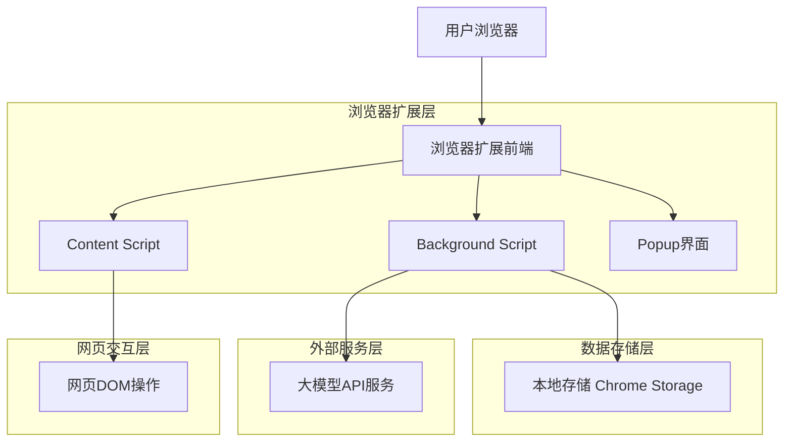
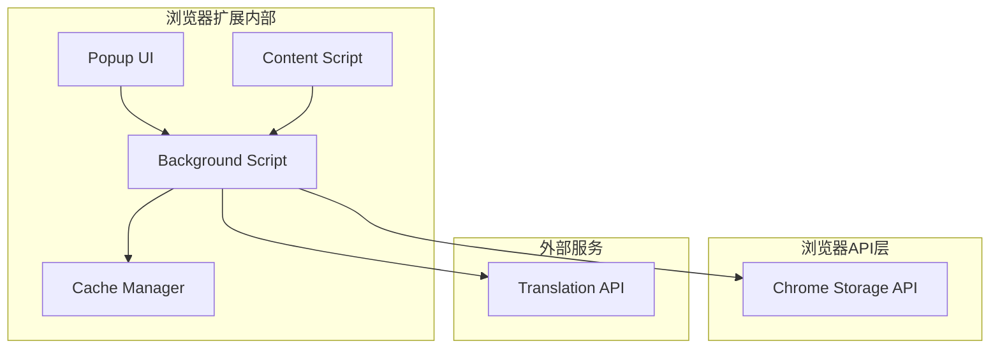
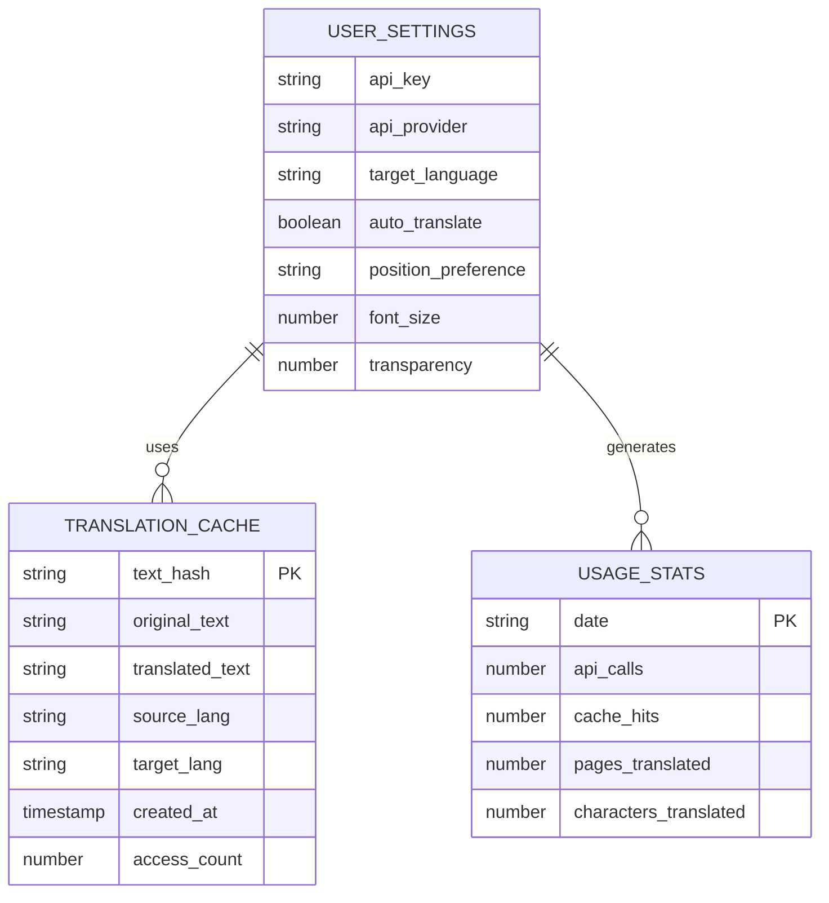

# 语影翻译插件技术架构文档

## 1. Architecture design



## 2. Technology Description

* **前端框架**: Vanilla JavaScript + Chrome Extension APIs

* **UI框架**: 原生CSS3 + HTML5（无需额外框架，减少包体积）

* **存储方案**: Chrome Storage API（同步用户设置和缓存）

* **API集成**: 多大模型API支持（DeepSeek默认，支持通义千问、OpenAI、Gemini、文心一言等）

* **构建工具**: Webpack 5 + Babel（ES6+转译和代码打包）

* **开发工具**: ESLint + Prettier（代码规范）

## 3. Route definitions

浏览器扩展的页面结构：

| Route         | Purpose                   |
| ------------- | ------------------------- |
| popup.html    | 设置面板主页面，显示API配置、翻译设置和使用统计 |
| options.html  | 详细设置页面，提供高级配置选项           |
| content.js    | 内容脚本，负责网页DOM操作和翻译浮动框显示    |
| background.js | 后台脚本，处理API调用、数据缓存和跨页面通信   |

## 4. API definitions

### 4.1 Core API

#### 翻译服务API

#### 多大模型API适配

**DeepSeek API**（默认推荐）
```
POST https://api.deepseek.com/v1/chat/completions
```

**通义千问API**
```
POST https://dashscope.aliyuncs.com/api/v1/services/aigc/text-generation/generation
```

**OpenAI API**
```
POST https://api.openai.com/v1/chat/completions
```

**Google Gemini API**
```
POST https://generativelanguage.googleapis.com/v1/models/gemini-pro:generateContent
```

**统一翻译接口**
```
POST /api/translate (内部统一接口)
```

Request:

| Param Name   | Param Type | isRequired | Description      |
| ------------ | ---------- | ---------- | ---------------- |
| text         | string     | true       | 待翻译的文本内容         |
| source\_lang | string     | false      | 源语言代码（auto为自动检测） |
| target\_lang | string     | true       | 目标语言代码（默认zh-CN）  |
| api\_provider| string     | true       | API服务商（deepseek/tongyi/openai/gemini/wenxin） |
| api\_key     | string     | true       | 用户配置的API密钥       |
| prompt\_type | string     | false      | 翻译prompt类型（general/academic/technical/news） |
| context      | string     | false      | 上下文信息（用于长文本翻译） |

Response:

| Param Name       | Param Type | Description |
| ---------------- | ---------- | ----------- |
| translated\_text | string     | 翻译后的文本      |
| detected\_lang   | string     | 检测到的源语言     |
| confidence       | number     | 翻译置信度       |

Example:

```json
{
  "text": "The quick brown fox jumps over the lazy dog.",
  "source_lang": "auto",
  "target_lang": "zh-CN",
  "api_key": "your-api-key"
}
```

#### 内部通信API

**Background Script与Content Script通信**

```
chrome.runtime.sendMessage()
```

Message Types:

| Message Type        | Data Structure                                       | Description |
| ------------------- | ---------------------------------------------------- | ----------- |
| TRANSLATE\_REQUEST  | {text: string, options: object}                      | 请求翻译指定文本    |
| TRANSLATE\_RESPONSE | {original: string, translated: string, lang: string} | 返回翻译结果      |
| SETTINGS\_UPDATE    | {key: string, value: any}                            | 更新用户设置      |
| CACHE\_QUERY        | {text: string}                                       | 查询缓存的翻译结果   |

## 5. Server architecture diagram

由于这是浏览器扩展，无需独立服务器，架构图如下：



## 6. Data model

### 6.1 Data model definition



### 6.2 Data Definition Language

由于使用Chrome Storage API，数据以JSON格式存储：

#### 用户设置 (chrome.storage.sync)

```javascript
// 用户设置数据结构
const userSettings = {
  apiKey: '', // API密钥
  apiProvider: 'deepseek', // API提供商：deepseek | tongyi | openai | gemini | wenxin
  targetLanguage: 'zh-CN', // 目标语言
  autoTranslate: false, // 自动翻译开关
  positionPreference: 'right', // 位置偏好：right | bottom
  fontSize: 14, // 字体大小
  transparency: 0.8, // 透明度（80%）
  shortcuts: {
    toggle: 'Alt+T', // 切换翻译快捷键
    settings: 'Alt+S' // 打开设置快捷键
  }
};

// 初始化默认设置
chrome.storage.sync.set({
  'yuying_settings': userSettings
});
```

#### 翻译缓存 (chrome.storage.local)

```javascript
// 翻译缓存数据结构
const translationCache = {
  [textHash]: {
    originalText: 'The quick brown fox...',
    translatedText: '快速的棕色狐狸...',
    sourceLang: 'en',
    targetLang: 'zh-CN',
    createdAt: Date.now(),
    accessCount: 1
  }
};

// 缓存管理
const CACHE_LIMIT = 1000; // 最大缓存条目数
const CACHE_EXPIRE = 7 * 24 * 60 * 60 * 1000; // 7天过期
```

#### 使用统计 (chrome.storage.local)

```javascript
// 使用统计数据结构
const usageStats = {
  daily: {
    [dateString]: {
      apiCalls: 0,
      cacheHits: 0,
      pagesTranslated: 0,
      charactersTranslated: 0
    }
  },
  total: {
    apiCalls: 0,
    cacheHits: 0,
    pagesTranslated: 0,
    charactersTranslated: 0,
    firstUseDate: Date.now()
  }
};
```

## 7. 翻译引擎技术实现

### 7.1 API适配器架构

```javascript
// API适配器基类
class TranslationAPIAdapter {
  constructor(apiKey, config = {}) {
    this.apiKey = apiKey;
    this.config = config;
  }

  async translate(text, options = {}) {
    throw new Error('translate method must be implemented');
  }

  validateConfig() {
    throw new Error('validateConfig method must be implemented');
  }
}

// DeepSeek API适配器
class DeepSeekAdapter extends TranslationAPIAdapter {
  constructor(apiKey) {
    super(apiKey, {
      baseURL: 'https://api.deepseek.com/v1',
      model: 'deepseek-chat'
    });
  }

  async translate(text, options = {}) {
    const prompt = this.buildPrompt(text, options);
    const response = await fetch(`${this.config.baseURL}/chat/completions`, {
      method: 'POST',
      headers: {
        'Authorization': `Bearer ${this.apiKey}`,
        'Content-Type': 'application/json'
      },
      body: JSON.stringify({
        model: this.config.model,
        messages: [{ role: 'user', content: prompt }],
        temperature: 0.3
      })
    });
    return this.parseResponse(response);
  }
}

// 通义千问API适配器
class TongyiAdapter extends TranslationAPIAdapter {
  constructor(apiKey) {
    super(apiKey, {
      baseURL: 'https://dashscope.aliyuncs.com/api/v1',
      model: 'qwen-turbo'
    });
  }

  async translate(text, options = {}) {
    const prompt = this.buildPrompt(text, options);
    const response = await fetch(`${this.config.baseURL}/services/aigc/text-generation/generation`, {
      method: 'POST',
      headers: {
        'Authorization': `Bearer ${this.apiKey}`,
        'Content-Type': 'application/json'
      },
      body: JSON.stringify({
        model: this.config.model,
        input: { prompt },
        parameters: { temperature: 0.3 }
      })
    });
    return this.parseResponse(response);
  }
}
```

### 7.2 翻译Prompt管理

```javascript
// Prompt模板管理器
class PromptManager {
  constructor() {
    this.templates = {
      general: `你是一个专业的翻译专家，请将以下文本准确翻译成中文。翻译要求：

1. **准确性**：保持原文的准确含义，不要添加或删除信息
2. **自然性**：使用自然流畅的中文表达，符合中文阅读习惯
3. **专业性**：根据上下文判断专业术语，保持术语的准确性和一致性
4. **语境适应**：根据文本类型调整翻译风格
5. **格式保持**：保持原文的格式结构

请直接输出翻译结果，不要包含解释或其他内容。

原文：{source_text}`,

      academic: `请将以下学术文本翻译成中文，保持学术写作的严谨性和专业术语的准确性：
{source_text}`,

      technical: `请将以下技术文档翻译成中文，保持技术术语的准确性，确保操作步骤清晰易懂：
{source_text}`,

      news: `请将以下新闻内容翻译成中文，保持新闻的客观性和时效性，使用简洁明了的表达：
{source_text}`,

      contextual: `你是一个专业的翻译专家。我将提供一段文本及其上下文，请进行准确翻译。

**上下文信息**：{context}
**当前段落**：{current_text}

翻译要求：
1. 结合上下文理解当前段落的含义
2. 保持术语和概念的一致性
3. 确保翻译的连贯性和逻辑性
4. 使用自然流畅的中文表达

请直接输出翻译结果：`
    };
  }

  getPrompt(type = 'general', variables = {}) {
    const template = this.templates[type] || this.templates.general;
    return this.interpolate(template, variables);
  }

  interpolate(template, variables) {
    return template.replace(/{(\w+)}/g, (match, key) => {
      return variables[key] || match;
    });
  }

  // 智能选择prompt类型
  detectPromptType(text, context = '') {
    const academicKeywords = ['research', 'study', 'analysis', 'methodology', 'hypothesis'];
    const technicalKeywords = ['API', 'function', 'configure', 'install', 'documentation'];
    const newsKeywords = ['reported', 'according to', 'breaking', 'announced', 'statement'];

    const lowerText = text.toLowerCase();
    
    if (academicKeywords.some(keyword => lowerText.includes(keyword))) {
      return 'academic';
    }
    if (technicalKeywords.some(keyword => lowerText.includes(keyword))) {
      return 'technical';
    }
    if (newsKeywords.some(keyword => lowerText.includes(keyword))) {
      return 'news';
    }
    
    return context ? 'contextual' : 'general';
  }
}
```

### 7.3 翻译服务管理器

```javascript
// 翻译服务管理器
class TranslationService {
  constructor() {
    this.adapters = new Map();
    this.promptManager = new PromptManager();
    this.cacheManager = new CacheManager();
    this.currentProvider = 'deepseek';
  }

  // 注册API适配器
  registerAdapter(provider, adapter) {
    this.adapters.set(provider, adapter);
  }

  // 设置当前API提供商
  setProvider(provider) {
    if (this.adapters.has(provider)) {
      this.currentProvider = provider;
    } else {
      throw new Error(`Provider ${provider} not registered`);
    }
  }

  // 执行翻译
  async translate(text, options = {}) {
    const {
      sourceLang = 'auto',
      targetLang = 'zh-CN',
      promptType,
      context = '',
      useCache = true
    } = options;

    // 检查缓存
    if (useCache) {
      const cached = await this.cacheManager.get(text, targetLang);
      if (cached) {
        return cached;
      }
    }

    // 智能选择prompt类型
    const finalPromptType = promptType || this.promptManager.detectPromptType(text, context);
    
    // 构建prompt变量
    const promptVariables = {
      source_text: text,
      current_text: text,
      context: context
    };

    // 获取当前适配器
    const adapter = this.adapters.get(this.currentProvider);
    if (!adapter) {
      throw new Error(`No adapter found for provider: ${this.currentProvider}`);
    }

    try {
      // 执行翻译
      const result = await adapter.translate(text, {
        promptType: finalPromptType,
        promptVariables,
        sourceLang,
        targetLang
      });

      // 缓存结果
      if (useCache && result.translatedText) {
        await this.cacheManager.set(text, result.translatedText, targetLang);
      }

      return result;
    } catch (error) {
      // API故障时尝试备用服务
      return this.handleFailover(text, options, error);
    }
  }

  // 故障转移处理
  async handleFailover(text, options, originalError) {
    const fallbackProviders = this.getFallbackProviders();
    
    for (const provider of fallbackProviders) {
      try {
        const originalProvider = this.currentProvider;
        this.setProvider(provider);
        const result = await this.translate(text, { ...options, useCache: false });
        this.setProvider(originalProvider); // 恢复原始提供商
        return result;
      } catch (error) {
        continue; // 尝试下一个提供商
      }
    }

    throw originalError; // 所有备用方案都失败
  }

  // 获取备用提供商列表
  getFallbackProviders() {
    const providers = Array.from(this.adapters.keys());
    return providers.filter(p => p !== this.currentProvider);
  }
}
```

### 7.4 缓存管理器

```javascript
// 缓存管理器
class CacheManager {
  constructor() {
    this.CACHE_KEY = 'yuying_translation_cache';
    this.CACHE_LIMIT = 1000;
    this.CACHE_EXPIRE = 7 * 24 * 60 * 60 * 1000; // 7天
  }

  // 生成缓存键
  generateKey(text, targetLang) {
    const hash = this.simpleHash(text + targetLang);
    return `${hash}_${targetLang}`;
  }

  // 简单哈希函数
  simpleHash(str) {
    let hash = 0;
    for (let i = 0; i < str.length; i++) {
      const char = str.charCodeAt(i);
      hash = ((hash << 5) - hash) + char;
      hash = hash & hash; // 转换为32位整数
    }
    return Math.abs(hash).toString(36);
  }

  // 获取缓存
  async get(text, targetLang) {
    const key = this.generateKey(text, targetLang);
    const cache = await this.getCache();
    const item = cache[key];

    if (item && Date.now() - item.createdAt < this.CACHE_EXPIRE) {
      item.accessCount++;
      await this.setCache(cache);
      return {
        translatedText: item.translatedText,
        fromCache: true
      };
    }

    return null;
  }

  // 设置缓存
  async set(text, translatedText, targetLang) {
    const key = this.generateKey(text, targetLang);
    const cache = await this.getCache();

    // 检查缓存大小限制
    if (Object.keys(cache).length >= this.CACHE_LIMIT) {
      await this.cleanupCache(cache);
    }

    cache[key] = {
      originalText: text,
      translatedText,
      targetLang,
      createdAt: Date.now(),
      accessCount: 1
    };

    await this.setCache(cache);
  }

  // 获取完整缓存
  async getCache() {
    return new Promise((resolve) => {
      chrome.storage.local.get([this.CACHE_KEY], (result) => {
        resolve(result[this.CACHE_KEY] || {});
      });
    });
  }

  // 保存缓存
  async setCache(cache) {
    return new Promise((resolve) => {
      chrome.storage.local.set({ [this.CACHE_KEY]: cache }, resolve);
    });
  }

  // 清理过期缓存
  async cleanupCache(cache) {
    const now = Date.now();
    const validEntries = Object.entries(cache)
      .filter(([_, item]) => now - item.createdAt < this.CACHE_EXPIRE)
      .sort(([_, a], [__, b]) => b.accessCount - a.accessCount) // 按访问次数排序
      .slice(0, Math.floor(this.CACHE_LIMIT * 0.8)); // 保留80%的容量

    const cleanedCache = Object.fromEntries(validEntries);
    await this.setCache(cleanedCache);
  }
}
```

